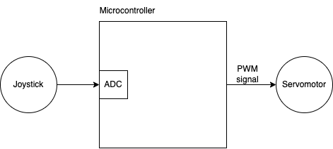
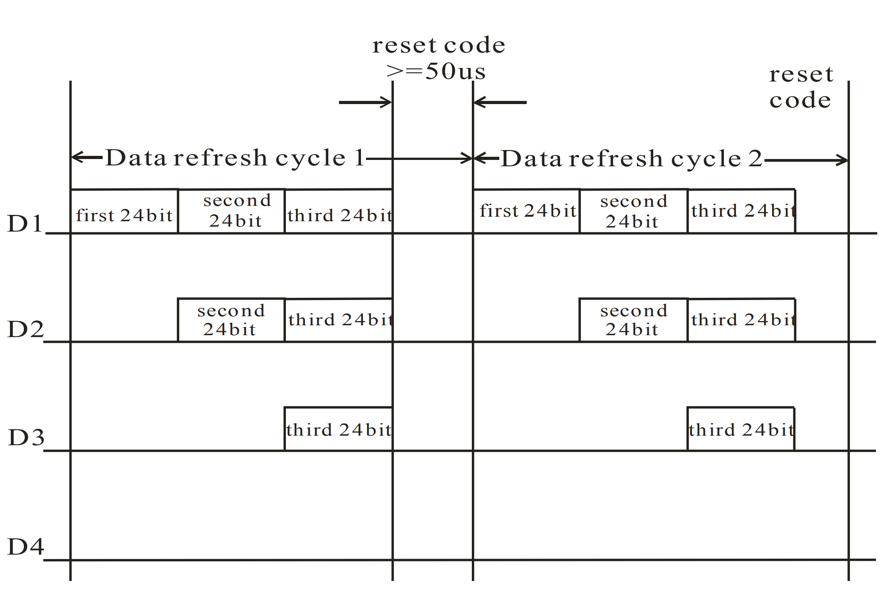
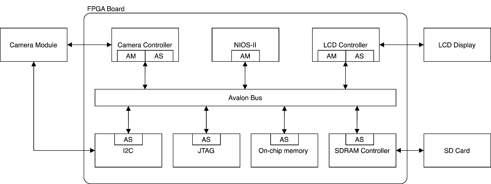
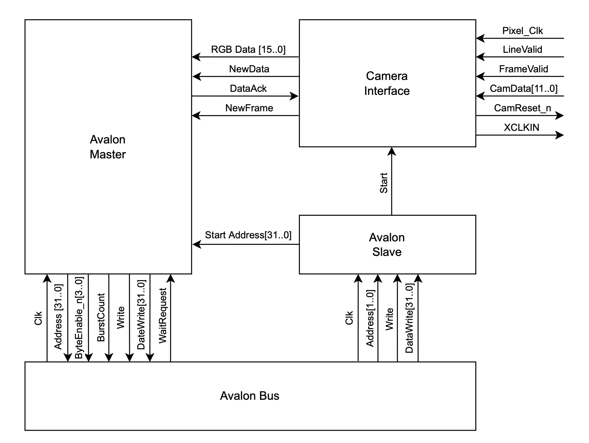

# Embedded Systems (CS-473)
This repo contains the labs of the course Embedded Systems at EPFL.

## Lab 1
The lab is about microcontroller input and output. The objective of the lab is to control the server motor through a joy stick. A server motor and a joy stick are connected to the the I/O ports of the microcontroller. The input from joy stick is fed to on-chip ADC and the PWM singal coming from microcontroller is fed to server motor. The diagram is shown below.

## Lab 2
The objective of the lab is to develop custom interface for [WS2812](https://cdn-shop.adafruit.com/datasheets/WS2812.pdf), which is a LED capable of latching the first few bits of signal received and propagating the rest to downstream components. An example system would be a chain of 4 LEDs where 24 bits are latched and the rest is propagated to the downstream LED. The waveform is illustrated as below.

 

In short, the lab entails developing digital circuit that stores color pattern and generates desired signal for these bit patterns. The following is a demo of our final result.

## Lab 3 and 4
The objective of the labs is to design interfaces for LCD display and camera modules, and the final system should be able to capture images with camera module and show these images with LCD display.

The lab 3 is about proposing an overall design, and lab 4 is implementing and adjusting the design. The overall system diagram is shown below.

Since it's a project between two groups, we are repsonsible for the camera part of the project, and the block diagram of our camera controller design is shown below.

 